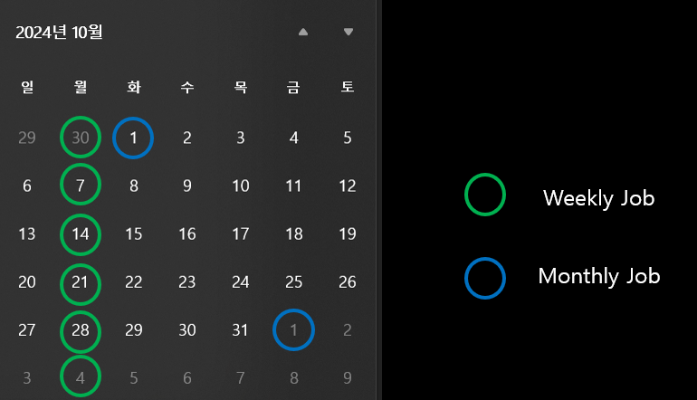

# 빅쿼리 slot 사용량 분석
## 프로젝트 시나리오
1. 평소 7000개의 slot을 예약
2. 약 400 개의 서비스 운영
2. 매일 raw/daily data 가공, 적재
3. 매주 월요일 weekly data 가공, 적재
4. 매달 1일 monthly data 가공, 적재

5. 모든 스케줄은 작업 완료 후, GCP Buckets에 작업 완료 '.end' 파일 생성
5. 모든 스케줄은 GCP Composer를 통해 Airflow로 관리
6. 특정 날에 job이 몰리면 지연 발생
7. 지연이 발생할 경우 slot을 12000개까지 증설하여 지연 해소
8. 그런데 어느 순간부터 slot을 12000개까지 증설하지 않아도 지연된 job 해소 가능

## 개요
**지연 발생 시점 :** 
- 2024년 10월 2일
- 2024년 10월 8일
- 2024년 11월 2일

**지연 해소 방법 :** 
- 10월 2일 - slot 12000으로 증설 -> 지연 미해소
- 10월 3일 - slot 12000으로 유지 -> 지연 해소
- 10월 8일 - slot 12000으로 증설 -> 지연 해소
- 11월 2일 - 자연 해소

## 분석 방법
**1. 2024년 9월 30일 ~ 2024년 11월 6일까지 job 비교 분석**
```sql
 -- Composer 별 slot 사용량 및 job 개수 조회 Query
SELECT
FORMAT_TIMESTAMP('%Y%m%d', creation_time) as cyymmdd,
user_email,
SUM(total_slot_ms) as ttl_slot,
COUNT(job_id) as cnt_job
FROM
`bigdata-project-id`.`region-asia-northeast3`.INFORMATION_SCHEMA.JOBS
WHERE
 -- 당시 프로젝트는 1일치의 job log 당, 50G 조회 비용
 -- 비용 최소화를 위해 주요 날짜 선별 조회
creation_time BETWEEN '2024-09-30' AND '2024-11-07'
 -- 쿼리 실행이 완료된 경우
AND state = 'DONE'
AND user_email like "%composer-email%"
GROUP BY
cyymmdd,
user_email
ORDER BY cyymmdd, user_email
```
**2. 조회 비용 최소화를 위해 주요 날짜 선별**
- 2024년 9월 30일 (Weekly 작업이 시작)
- 2024년 10월 1일 (Monthly 작업이 시작)
- 2024년 10월 2일 (slot 12000 증설 - 지연 미해소)
- 2024년 10월 3일 (slot 12000 증설 - 지연 해소)
- 2024년 10월 7일 (Weekly 작업이 시작)
- 2024년 10월 8일 (slot 12000 증설 - 지연 해소)
- 2024년 11월 1일 (Monthly 작업이 시작)
- 2024년 11월 2일 (slot 7000 유지 - 지연 해소)
- 2024년 11월 3일 (slot 7000 유지 - 지연 해소)
- 2024년 11월 4일 (Weekly 작업이 시작)
- 2024년 11월 5일 (slot 7000 유지 - 지연 해소)

## 분석 포인트
### 1. 비정상적으로 적은 작업량 (<span style="color: #FFDB58;">raw 작업이 대다수 지연</span>)
**1-1. 2024년 10월 1일 - 작업량이 다른 Weekly/Monthly 작업 있는 날 대비 <span style="color: #FFDB58;">1/2</span> 수준**
| cyymmdd | user_email | ttl_slot(ms) | cnt_job |
|---------|------------|----------|---------|
| 20240930 | bigdata-composer-raw | 801,744,939,636 | 170338 |
| 20240930 | bigdata-composer-daily | 67,356,000,574 | 24156 |
| 20240930 | bigdata-composer-weekly-monthly | 112,267,856,797 | 8667 |
||| 981,368,797,007 | 203161 |
|
| 20241001 | bigdata-composer-raw | 475,367,711,149 | <span style="color: #FFDB58;">83496</span> |
| 20241001 | bigdata-composer-daily | 105,218,934,496 | 22779 |
| 20241001 | bigdata-composer-weekly-monthly | 206,088,661,735 | 4346 |
||| 786,675,307,380 | <span style="color: #FFDB58;">110621</span> |
|
| 20241101 | bigdata-composer-raw | 786,091,595,665 | 193327 |
| 20241101 | bigdata-composer-daily | 37,062,270,462 | 15516 |
| 20241101 | bigdata-composer-weekly-monthly | 155,284,772,649 | 6601 |
||| 978,438,638,776 | 215444 |
|

**1-2. <span style="color: #FFDB58;">10월 1일</span> vs 11월 1일 - 총 작업시간(Duration Time)은 비슷**
```sql
 -- 10-01 총 작업시간 Query
SELECT
FORMAT_TIMESTAMP('%Y%m%d', creation_time) as cyymmdd,
user_email,
SUM(TIMESTAMP_DIFF(end_time, start_time, SECOND)) as duration_time
FROM
`bigdata-project-id`.`region-asia-northeast3`.INFORMATION_SCHEMA.JOBS
WHERE
 -- 10/01과 11/01 조회하여 비교
creation_time BETWEEN '2024-10-01' AND '2024-10-02'
 -- 쿼리 실행이 완료된 경우
AND state = 'DONE'
AND user_email like "%composer-email%"
GROUP BY
cyymmdd,
user_email
ORDER BY cyymmdd, user_email
```
| cyymmdd | user_email | duration_time(s) |
|---------|------------|----------|
| 20241001 | bigdata-composer-raw | 2172895 |
| 20241001 | bigdata-composer-daily | 790686 |
| 20241001 | bigdata-composer-weekly-monthly | 1035075 |
||| <span style="color: #FFDB58;">3998656</span> |
|
| 20241101 | bigdata-composer-raw | 3592954 |
| 20241101 | bigdata-composer-daily | 734030 |
| 20241101 | bigdata-composer-weekly-monthly | 93131 |
||| <span style="color: #FFDB58;">4420115</span> |
|

**1-3. <span style="color: #FFDB58;">10월 1일</span> vs 11월 1일 - 평균 작업시간은 더 긺 (raw 작업 제외)**
```sql
 -- 10-01 작업시간 평균 Query
SELECT
FORMAT_TIMESTAMP('%Y%m%d', creation_time) as cyymmdd,
user_email,
AVG(TIMESTAMP_DIFF(end_time, start_time, SECOND)) as duration_time
FROM
`bigdata-project-id`.`region-asia-northeast3`.INFORMATION_SCHEMA.JOBS
WHERE
 -- 10/01과 11/01 조회하여 비교
creation_time BETWEEN '2024-10-01' AND '2024-10-02'
 -- 쿼리 실행이 완료된 경우
AND state = 'DONE'
AND user_email like "%composer-email%"
GROUP BY
cyymmdd,
user_email
ORDER BY cyymmdd, user_email
```
| cyymmdd | user_email | duration_time(s) |
|---------|------------|----------|
| 20241001 | bigdata-composer-raw | 26.02394 |
| 20241001 | bigdata-composer-daily | <span style="color: #FFDB58;">34.71118</span> |
| 20241001 | bigdata-composer-weekly-monthly | <span style="color: #FFDB58;">238.1673</span> |
|
| 20241101 | bigdata-composer-raw | 18.58485 |
| 20241101 | bigdata-composer-daily | <span style="color: #FFDB58;">6.002256</span> |
| 20241101 | bigdata-composer-weekly-monthly | <span style="color: #FFDB58;">111.1998</span> |
|

**1-4. <span style="color: #FFDB58;">10월 1일</span> vs 11월 1일 - 평균 작업시간 238(s) 보다 오래 걸린 job이 더 많음 (raw 작업 제외)**
```sql
 -- 10-01 작업시간 평균 Query
SELECT
FORMAT_TIMESTAMP('%Y%m%d', creation_time) as cyymmdd,
user_email,
COUNT(TIMESTAMP_DIFF(end_time, start_time, SECOND)) as count_up_238
FROM
`bigdata-project-id`.`region-asia-northeast3`.INFORMATION_SCHEMA.JOBS
WHERE
 -- 10/01과 11/01 조회하여 비교
creation_time BETWEEN '2024-10-01' AND '2024-10-02'
 -- 쿼리 실행이 완료된 경우
AND state = 'DONE'
AND user_email like "%composer-email%"
 -- 10/01 Weekly, Monthly 평균 작업 시간 이상의 Job 조회
AND TIMESTAMP_DIFF(end_time, start_time, SECOND) > 238
GROUP BY
cyymmdd,
user_email
ORDER BY cyymmdd, user_email
```
| cyymmdd | user_email | count_up_238 |
|---------|------------|----------|
| 20241001 | bigdata-composer-raw | 1223 |
| 20241001 | bigdata-composer-daily | <span style="color: #FFDB58;">456</span> |
| 20241001 | bigdata-composer-weekly-monthly | <span style="color: #FFDB58;">403</span> |
|
| 20241101 | bigdata-composer-raw | 2166 |
| 20241101 | bigdata-composer-daily | <span style="color: #FFDB58;">46</span> |
| 20241101 | bigdata-composer-weekly-monthly | <span style="color: #FFDB58;">282</span> |
|

### 2. 지연 해소 위해 slot 12000으로 증설 (<span style="color: red;">raw, daily 작업은 24시간 내에 완료 필요</span>)
**slot 증설로 사용한 slot 수, 처리한 job 수 증가**
| cyymmdd | user_email | ttl_slot(ms) | cnt_job |
|---------|------------|----------|---------|
| 20241002 | bigdata-composer-raw | 1,601,192,996,700 | 291435 |
| 20241002 | bigdata-composer-daily | 148,453,606,906 | 39343 |
| 20241002 | bigdata-composer-weekly-monthly | 12,083 | 1 |
||| <span style="color: red;">1,749,646,615,689</span> | <span style="color: red;">330779</span> |
|
| 20241003 | bigdata-composer-raw | 1,380,787,356,441 | 257731 |
| 20241003 | bigdata-composer-daily | 201,341,432,404 | 58321 |
| 20241003 | bigdata-composer-weekly-monthly | 16,161 | 1 |
||| <span style="color: red;">1,582,128,805,006</span> | <span style="color: red;">316053</span> |
|
| 20241008 | bigdata-composer-raw | 1,391,451,019,781 | 232903 |
| 20241008 | bigdata-composer-daily | 248,578,162,872 | 57925 |
| 20241008 | bigdata-composer-weekly-monthly | 10,864 | 2 |
||| <span style="color: red;">1,640,029,193,517</span> | <span style="color: red;">290830</span> |
|
| 20241102 | bigdata-composer-raw | 843,561,910,915 |219694 |
| 20241102 | bigdata-composer-daily | 163,329,667,464 |57234 |
| 20241102 | bigdata-composer-weekly-monthly | 11,035 | 1 |
||| 1,006,891,589,414 | 276929 |
|

### 3. 비슷한 job 수에도 slot 7000 유지 (<span style="color: skyblue;">Weekly, Monthly 작업 수행 방식 변경</span>)
**3-1. <span style="color: red;">기존 : </span> Weekly, Monthly 작업은 <span style="color: red;">개별</span> 서비스마다 GCP Bucket의 raw, daily 작업의 '.end' 파일 체크 후, job 수행 -> <span style="color: red;">동시 작업 증가로 slot 경쟁 발생</span>**
```python
# Airflow - Weekly DAG Workflow (Python Code)

# 서비스 명 가져오기
service_name = params['service_name'].uppser()
# Sensor Operator에 넣어줄 리스트 선언
gcs_objects = []

# Month : DAG 실행 날짜의 ds 기반으로 전월 가져와서 path 생성
# monthly_date = str(kwargs['tomorrow_ds_nodash'])
# day_end = calender.monthrange(int(monthly_date[:4], int(monthly_date[4:6])))[1]

# 7일치 '.end' 파일 확인을 위한 path 생성
day_end = 7

for i in range(1, day_end+1):
    # macros.ds_add()로 i일씩 더하는 문자열 생성
    target_date = 'macros.ds_format(macros.ds_add(ds, days={}), "%Y-%m-%d", "%Y%m%d")'.format(i)
    # airflow jinja 탬플릿( {{...}} ) 형식의 문자열로 변환
    target_date = '{{ %s }}'%target_date
    # 체크해야 할 path 추가
    gcs_objects.append('success/{target_date}/{service_name}.end'.format(target_date=target_date, service_name=service_name))

# GoogleCloudStorageMultiObjectSensor : Airflow에서 Google Cloud Storage(GCS)의 특정 버킷에 여러 개의 객체가 존재하는지 확인하는 Sensor
check_end_file = GoogleCloudStorageMultiObjectSensor(
    task_id='check_end_file',
    bucket='bucketname',
    objects=gcs_objects,
    reschedule_interval=1200, # 20분 간격으로 확인
    timeout=86400,      # 24시간 초과하면 fail
    mode='reschedule', # 상태 변화 감지해도 한 번 더 확인
    soft_fail=False # task 실패시 DAG 실패
)
```
**3-2. 같은 시간대에 raw, daily, weekly, monthly 작업이 slot 경쟁을 하며 수행되고 있음**
```sql
 -- 시간별 작업 이력 Query
SELECT
FORMAT_TIMESTAMP('%Y%m%d-%H', creation_time) as cyymmddH,
job_id
FROM
`bigdata-project-id`.`region-asia-northeast3`.INFORMATION_SCHEMA.JOBS
WHERE
 -- 10/01과 11/01 조회하여 비교
creation_time BETWEEN '2024-10-01' AND '2024-10-02'
 -- 쿼리 실행이 완료된 경우
AND state = 'DONE'
 -- daily 작업이 완료된 후 weekly, monthly 작업이 수행되는 것을 확인하기 위해 3개만 조회
AND user_email IN ("bigdata-composer-email-daily.iam.gserviceaccount.com", "bigdata-composer-email-weekly.iam.gserviceaccount.com", "bigdata-composer-email-monthly.iam.gserviceaccount.com")
 -- 수 많은 작업 task중 실질적으로 빅쿼리 slot을 사용하는 airflow_ 명칭이 붙은 task 조회
AND job_id like "%airflow_%"
ORDER BY cyymmddH
```
| cyymmddH | job_id |
|---------|------------|
| 20241001-00 | airflow_month_v01_app1_2024_08_31T22_00_00_00_00_hashcode |
| <span style="color: red;">20241001-00</span> | airflow_<span style="color: red;">month</span>_v01_app2_2024_08_31T22_00_00_00_00_hashcode |
| <span style="color: red;">20241001-00</span> | airflow_<span style="color: red;">day</span>_v02_app3_2024_08_31T15_40_00_00_00_hashcode |
| 20241001-00 | airflow_day_v02_app4_2024_08_31T15_40_00_00_00_hashcode |
| <span style="color: red;">20241001-00</span> | airflow_<span style="color: red;">weekly</span>_v01_app1_2024_08_31T22_00_00_00_00_hashcode |
| 20241001-00 | airflow_weekly_v01_app2_2024_08_31T22_00_00_00_00_hashcode |
| 20241001-01 | airflow_month_v01_app3_2024_08_31T22_00_00_00_00_hashcode |
| <span style="color: red;">20241001-01</span> | airflow_<span style="color: red;">month</span>_v01_app4_2024_08_31T22_00_00_00_00_hashcode |
| <span style="color: red;">20241001-01</span> | airflow_<span style="color: red;">day</span>_v02_app1_2024_08_31T15_40_00_00_00_hashcode |
| 20241001-01 | airflow_day_v02_app2_2024_08_31T15_40_00_00_00_hashcode |
| <span style="color: red;">20241001-01</span> | airflow_<span style="color: red;">weekly</span>_v01_app4_2024_08_31T22_00_00_00_00_hashcode |
| 20241001-01 | airflow_weekly_v01_app9_2024_08_31T22_00_00_00_00_hashcode |
|

**3-3. <span style="color: skyblue;">변경 후 : </span> Daily 작업 모니터링 DAG으로 GCP Bucket에 <span style="color: skyblue;">모든</span> 서비스의 daily 작업 '.end' 파일 체크 후, <span style="color: skyblue;">'daily.end'</span> 파일 생성**
```python
# Airflow - Daily Monitoring DAG Workflow (Python Code)

def check_svc_done(**kwargs):
    # 서비스 리스트 가져오기
    svc_list = Variable.get("svc_list", deserialize_json=True)
    target_num = len(svc_list)
    # xcom에 target_num 값 저장
    return target_num

# PythonOperator : Airflow에서 파이썬 코드를 실행하는 Operator
check_svc_done = PythonOperator(
    task_id='check_svc_done',
    python_callable=check_svc_done
)

# BashSensor : Airflow에서 Bash 명령어를 실행하여 특정 조건이 만족될 때까지 대기하는 Sensor
check_fin_bash = BashSensor(
    task_id='check_fin_bash',
    bash_command="""
    #!/bin/sh

    # Google Cloud Storage(GCS)의 특정 버킷의 '.end' 파일 count
    fin_num=$(gsutil ls gs://success/{{ execution_date + macros.timedelta(days=(1))).strftime("%Y%m%d") }}/ | grep .end |wc -l)

    # check_svc_done task에서 반환한 서비스 개수랑 비교
    if [ "$fin_num" == {{ ti.xcom_pull(task_ids='check_svc_done') }} ]
    then
        exit 0
    else
        exit 1
    fi
    """,
    output_encoding='utf-8',
    poke_interval=30
)

# BashOperator : Airflow에서 Bash 명령어를 실행하는 Operator
check_fin_bash = BashOperator(
    task_id='create_daily_end',
    bash_command="""
    # daily.end 생성 후 Google Cloud Storage(GCS)의 특정 버킷의 'daily.end' 파일 복사
    touch daily.end && gsutil cp daily.end gs://success/{{ (execution_date + macros.timedelta(days=(1))).strftime("%Y%m%d") }}/daily.end
    """
)
```

**3-4. <span style="color: skyblue;">변경 후 : </span> Weekly, Monthly 작업은 GCP Bucket에 <span style="color: skyblue;">모든</span> 서비스의 raw, daily 작업 '.end' 파일 체크 후, job 수행 -> <span style="color: skyblue;">raw, daily 작업이 끝나고 Weekly, Monthly 작업이 시작되는 효과</span>**
```python
# Airflow - Weekly/Monthly DAG Workflow (Python Code)

service_name = params['service_name'].uppser()
gcs_objects = []

# Month : DAG 실행 날짜의 ds 기반으로 전월 가져와서 path 생성
# monthly_date = str(kwargs['tomorrow_ds_nodash'])
# day_end = calender.monthrange(int(monthly_date[:4], int(monthly_date[4:6])))[1]
# for i in range(1, day_end+1):

# Week : 7일치 '.end' 파일 확인을 위한 path 생성
day_end = 7

for i in range(1, day_end+1):
    target_date = 'macros.ds_format(macros.ds_add(ds, days={}), "%Y-%m-%d", "%Y%m%d")'.format(i)
    target_date = '{{ %s }}'%target_date
    gcs_objects.append('success/{target_date}/{service_name}.end'.format(target_date=target_date, service_name=service_name))

    # 모든 daily 작업 완료 확인 로직 추가
    if i == day_end:
        gcs_objects.append('success/{target_date}/{service_name}.end'.format(target_date=target_date, service_name='daily'))

check_end_file = GoogleCloudStorageMultiObjectSensor(
    task_id='check_end_file',
    bucket='bucketname',
    objects=gcs_objects,
    reschedule_interval=1200,
    timeout=86400,
    mode='reschedule',
    soft_fail=False
)
```

| cyymmddH | job_id |
|---------|------------|
| 20241101-00 | airflow_day_v02_app4_2024_10_30T15_40_00_00_00_hashcode |
| 20241101-00 | airflow_day_v02_app2_2024_10_30T15_40_00_00_00_hashcode |
| <span style="color: skyblue;">20241001-00</span> | airflow_<span style="color: skyblue;">day</span>_v02_app3_2024_10_30T15_40_00_00_00_hashcode |
| <span style="color: skyblue;">20241001-01</span> | airflow_<span style="color: skyblue;">month</span>_v01_app4_2024_08_31T22_00_00_00_00_hashcode |
| 20241001-01 | airflow_month_v01_app1_2024_08_31T22_00_00_00_00_hashcode |
| 20241001-01 | airflow_month_v01_app3_2024_08_31T22_00_00_00_00_hashcode |
|

## 결론
### 1. Weekly, Monthly 작업의 Task 수행 방식 변경으로 slot의 경쟁이 감소
### 2. 다만, 변경된 로직은 Daily 작업과 Weekly/Monthly 작업의 충돌만 막은 것
### 3. 따라서 또 다시 Weekly, Monthly 작업이 연달아 수행된다면, Weekly 작업과 Monthly 작업끼리의 slot 경쟁으로 지연 발생의 가능성은 여전히 있음

## 사후 대응
### 2024-12-01(일요일) Monthly 작업이 수행되고, 2024-12-02(월요일) Weekly 작업이 연달아 수행되기 때문에 12월 모니터링 후 대응 방법 재검토