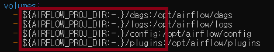

# [Docker compose] Airflow 설치

### Docker Compose 파일 만들기
```bash
# airflow 폴더 생성
mkdir ~/airflow
cd ~/airflow
```
```bash
# docker-compose.yaml 파일 다운로드
curl -LfO 'https://airflow.apache.org/docs/apache-airflow/stable/docker-compose.yaml'
```

### Airflow 필요 폴더들 만들기

- 빨간 테두리의 폴더들이 docker-compose.yaml과 같은 경로에 있어야한다.
- 지정 폴더 경로를 AIRFLOW_PROJ_DIR 변수 값으로 넣었다면 해당 경로에서 dags, logs, config, plugins 폴더를 찾을 것이고, 변수 값을 따로 지정하지 않았다면 ./(현재 경로)에서 찾을 것이다
```bash
# docker-compose.yaml파일 위치로 이동한 후
mkdir -p ./dags ./logs ./config ./plugins
# logs 폴더에 모든 권한 부여
sudo chmod -R 777 ~/airflow/logs
```

### 도커 컴포즈로 이미지 pull
```bash
# Docker-compose.yaml에 세팅되어 있음
sudo docker compose pull
```

### 도커 컴포즈로 Airflow 실행
```bash
# -d은 백그라운드 실행
sudo docker compose up -d
```

### url 접속
```text
http://localhost:8080/
초기 계정
ID : airflow
PW : airflow
```