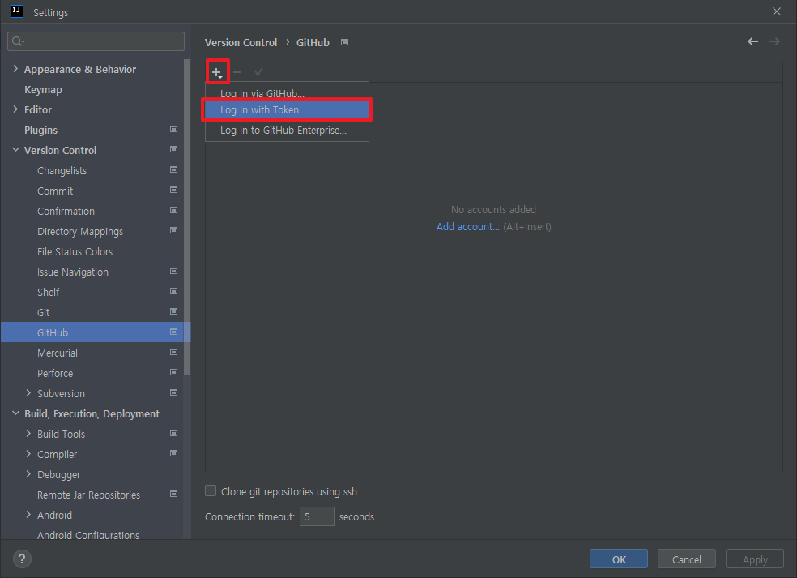
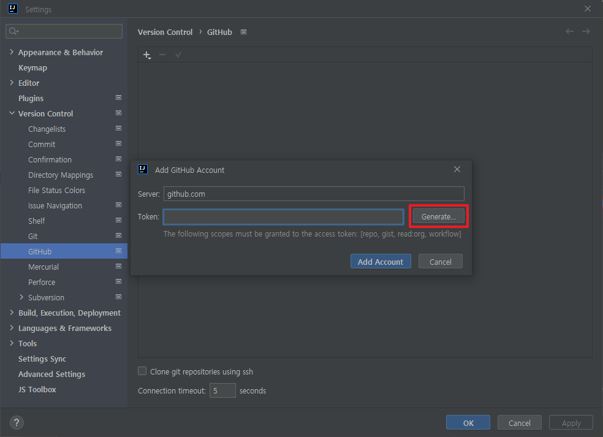
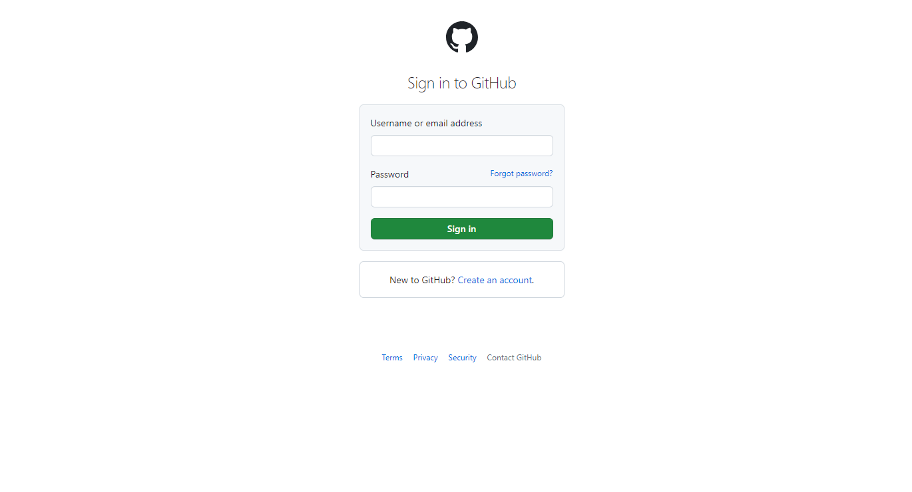
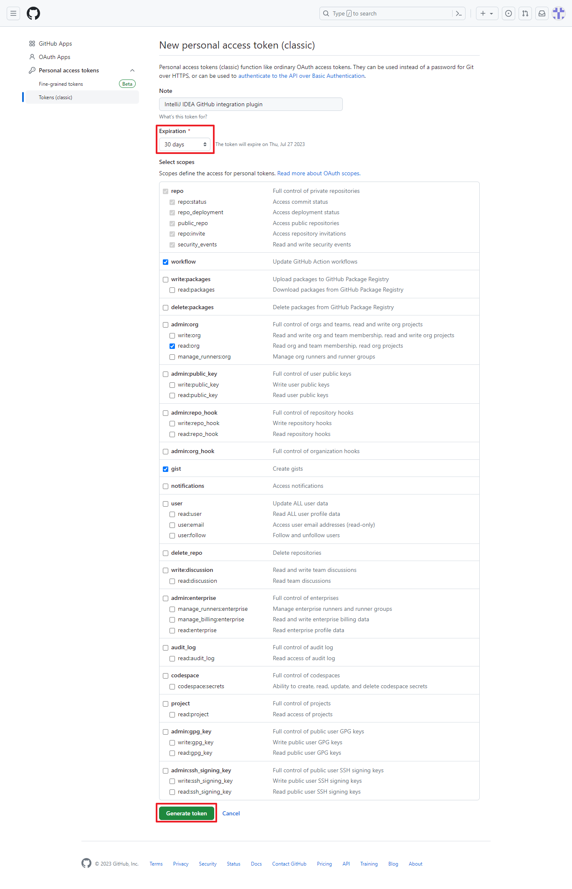
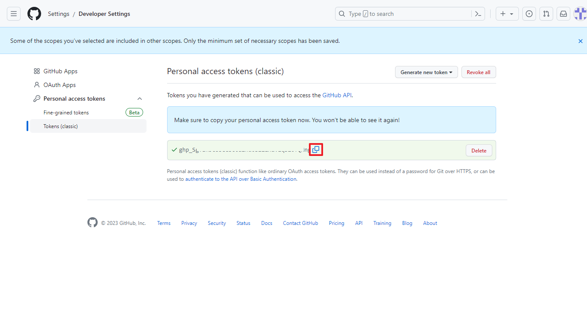
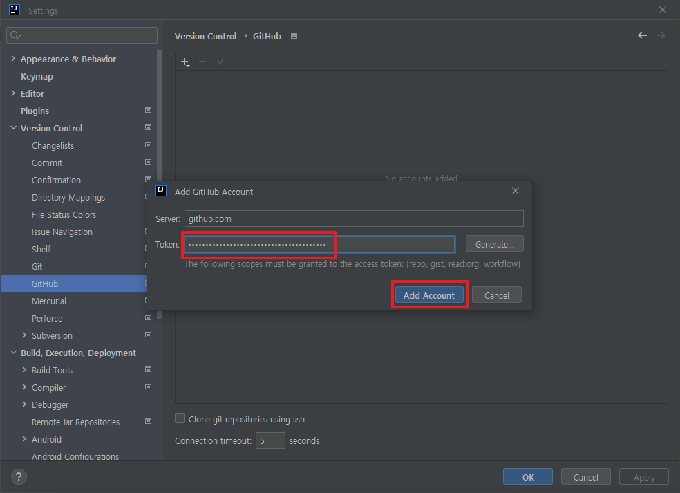

# Git 설정
Access Token을 이용한 방식을 사용

--------------------------------------------------------------------------------
## Access Token 생성

### File > Settings > Version Control > GitHub
(+) 버튼 클릭 > Log In With Token... 선택

Generate... 버튼 클릭

Github 로그인 페이지로 자동 이동

Expiration 을 원하는 값으로 수정하고 "Generate Token" 버튼 클릭

생성된 Access Token 복사

생성된 Access Token 붙여넣고, "Add Account" 버튼 클릭

--------------------------------------------------------------------------------
## 활용
### File > New > Project from Version Control...
GitHub 클릭시 모든 저장소 출력.
원하는 저장소와 Directory 설정 후 Clone 버튼 클릭

