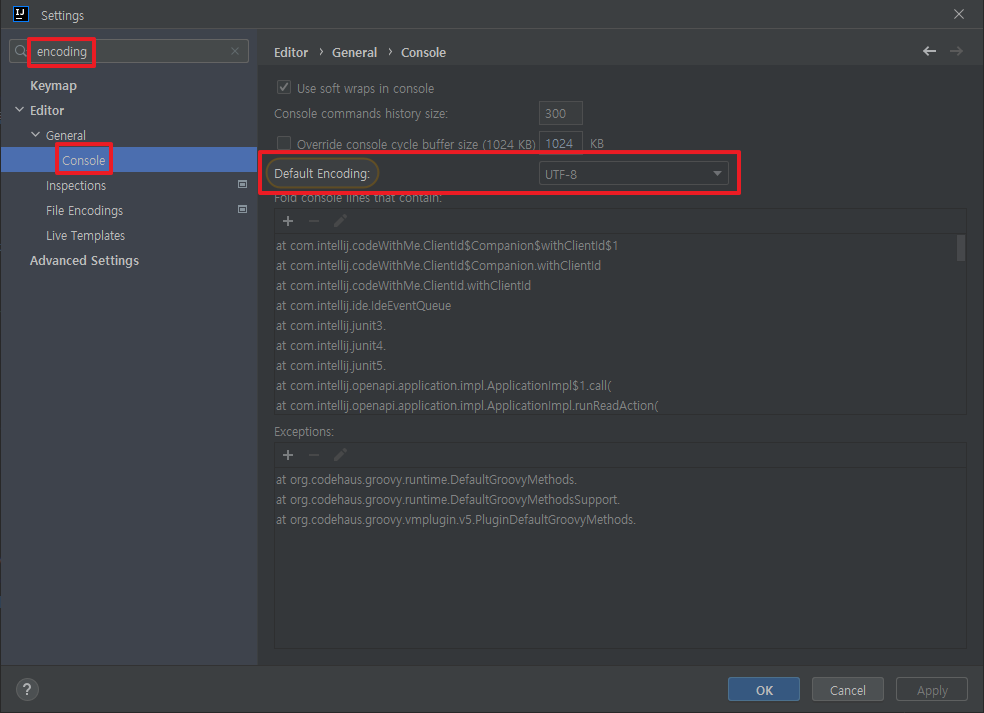
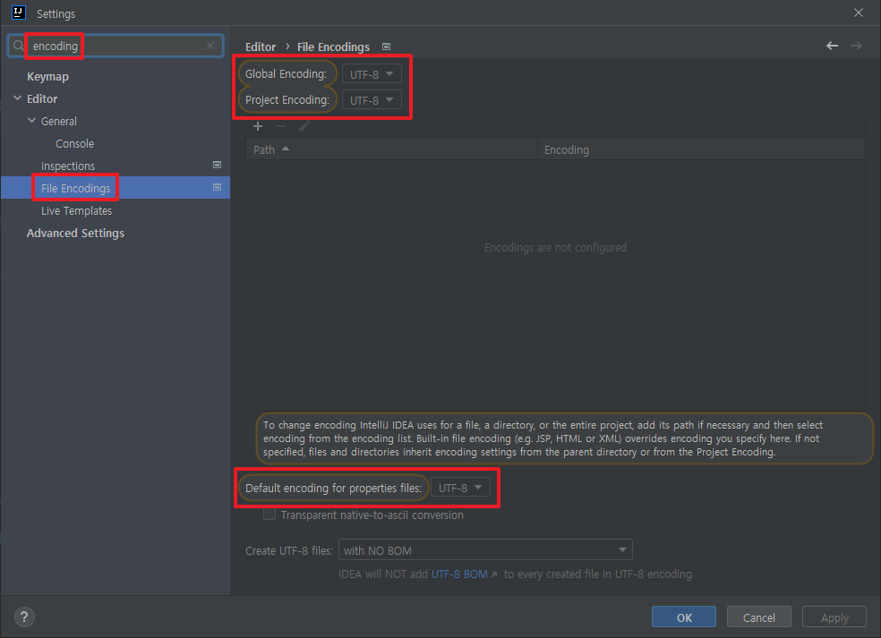
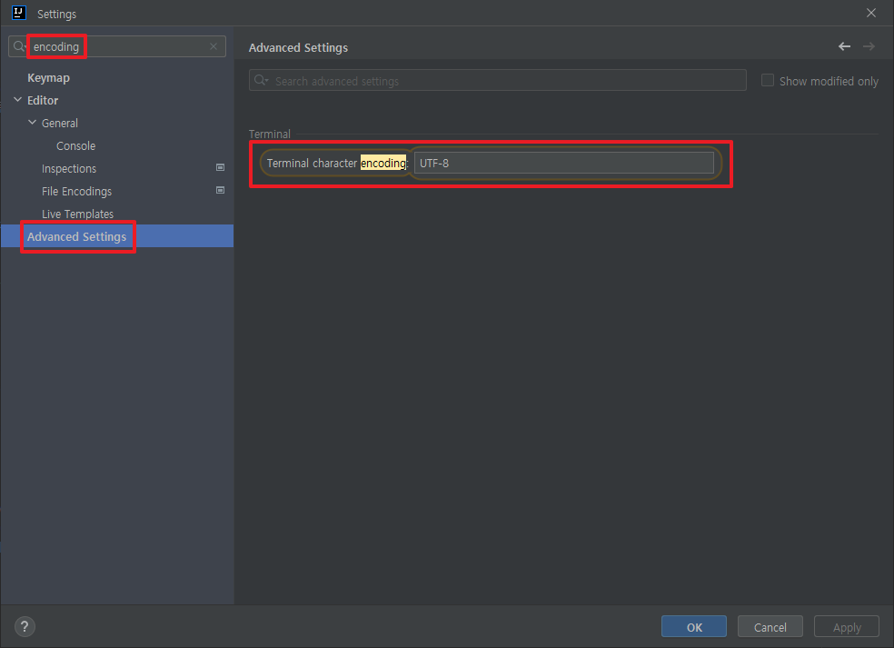
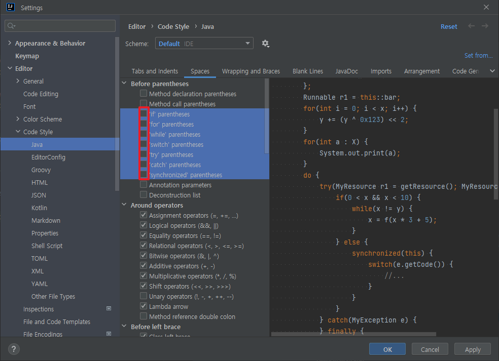
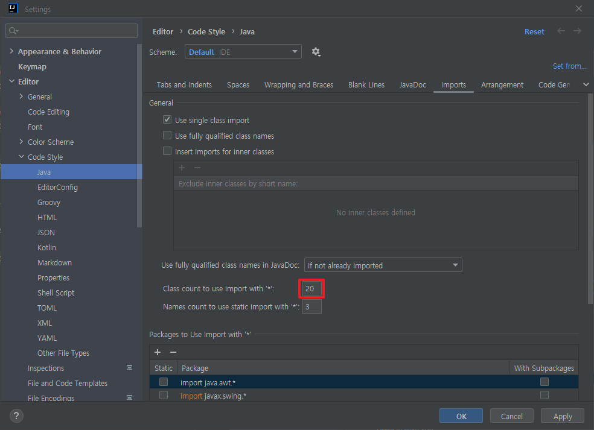

# IntelliJ 환경설정

--------------------------------------------------------------------------------
## Encoding 설정
모든 설정값을 UTF-8로 변경

### File > Settings > Editor > General > Console

### File > Settings > Editor > File Encodings

### File > Settings > Advanced Settings

--------------------------------------------------------------------------------
## Java Code Style
### File > Settings > Editor > Code Style > Java
#### Spaces > Before parentheses

#### Imports

