# SSH 원격 접속

## SSH 원격 접속

### MobaXterm(ssh 접속 툴) 설치 
- https://mobaxterm.mobatek.net/download.html

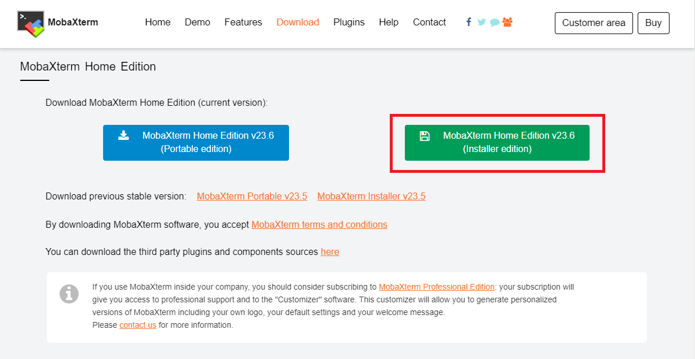

## SSH 연결
### 노드들이 로컬 기기에 있는 경우
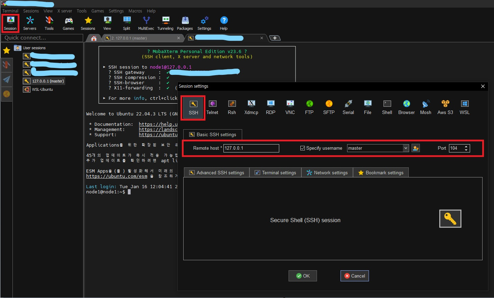
### 노드들이 외부 기기에 있는 경우, 외부 기기 접속을 위한 포트포워딩 필요
- 포트 열기
  - 사용 중인 TCP 포트 확인 (사용 예정 : 12345)
    ```bash
    $ sudo ss -tl # 사용 예정인 포트 사용하는지 확인
    ```
  - 외부 기기 포트 변경
    ```bash
    $ sudo vi /etc/ssh/sshd_config # 외부 기기 포트 설정 : 12345
    ```
    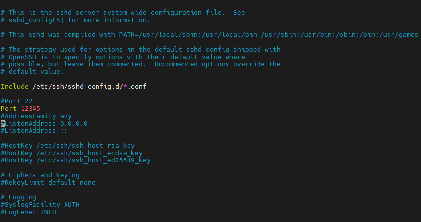
  - ssh 서버 재기동
    ```bash
    $ sudo service ssh restart # 외부 기기 포트 설정 : 12345
    $ sudo service ssh status # ssh 서버 상태 확인 (active/running 확인)
    ```
  - 방화벽 실행 후, 외부 기기로 접근할 포트 허용
    ```bash
    $ sudo ufw enable # 방화벽 실행
    $ sudo ufw status # 방화벽 상태 확인 (active/활성 확인)
    $ sudo ufw allow 12345 # 외부 기기로 접근할 포트 허용
    $ sudo ufw status # 방화벽 상태 확인 (active/활성/포트 12345 추가 확인)
    ```
    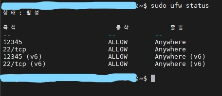

- ipTIME을 이용한 포트 포워딩
  - 내부 IP 확인
    ```bash
     $ ip addr # 내부 IP 확인
    ```
    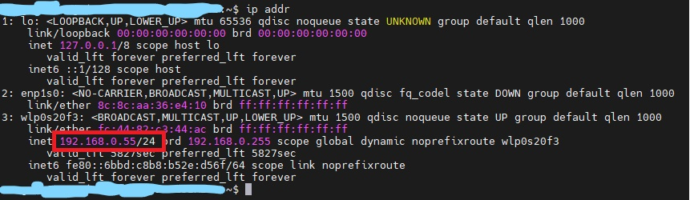
  - ipTIME 관리 페이지 접속(http://192.168.0.1/)
    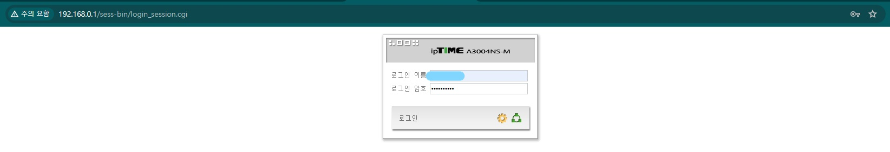
  - 관리도구 > 고급설정 > NAT/라우터 관리 > 포트포워드 설정

    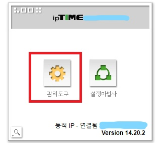
    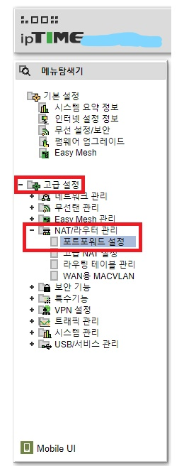
    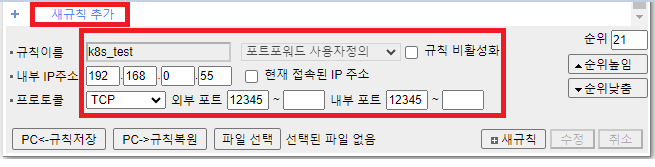
  - 외부 IP 확인
    ```bash
     $ curl ifconfig.me # 외부 IP 확인
    ```
- 원격 PC에서 MobaXterm로 외부 기기 SSH 접근 ( ** 모든 노드들은 전원이 켜져 있어야한다.)
  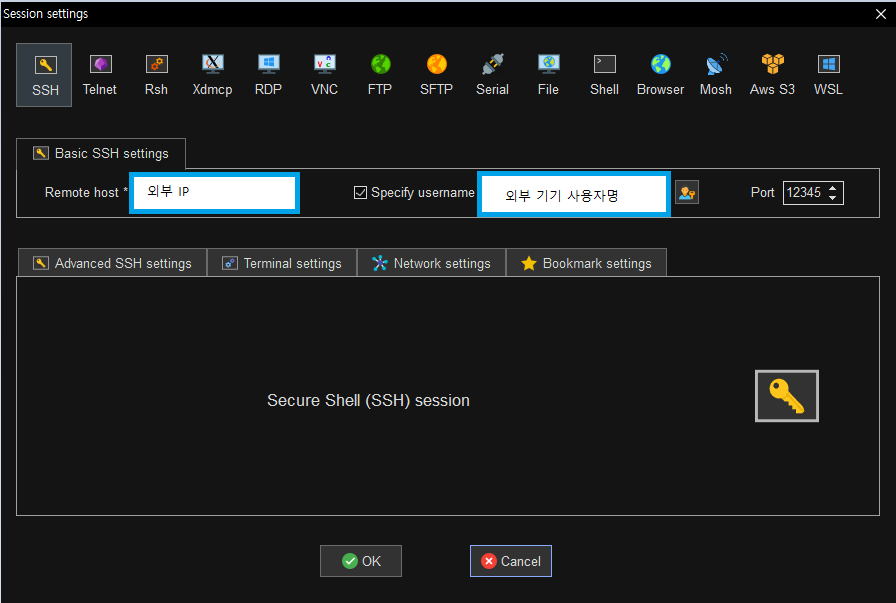
- 원격 PC에서 MobaXterm로 node1, node2 SSH 접근
  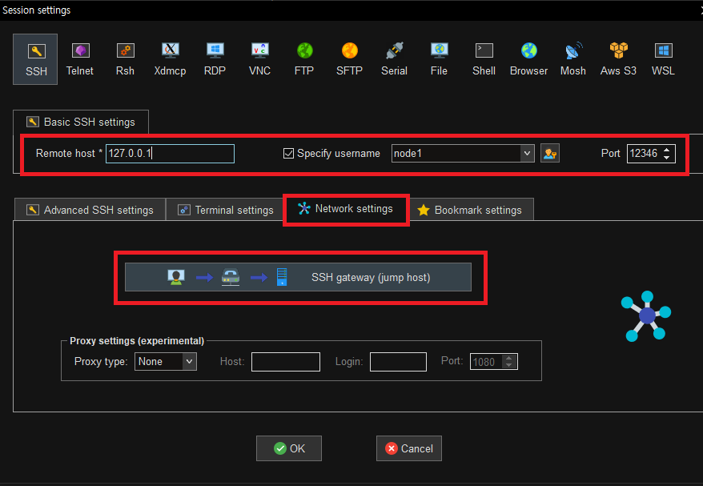
  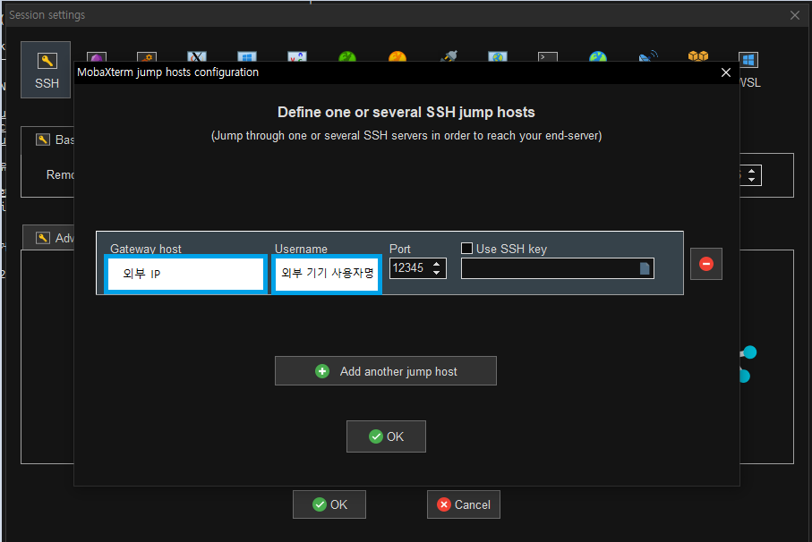