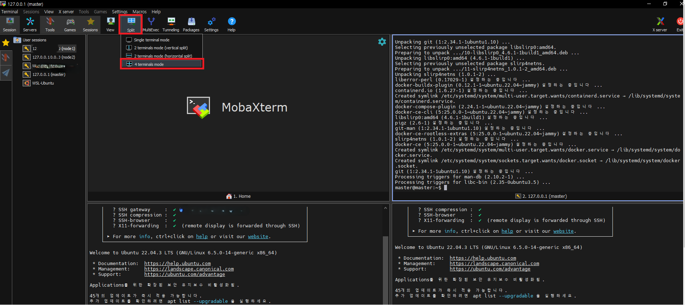

# 도커 설치

### MobaXterm에 모든 노드 연결 확인
- 참고 : 동시에 여러 session 확인 가능
 

### CLI 명령어를 통해 모든 노드에 도커 설치
```bash
# 이전에 도커가 설치되었던 경우라면 도커 전부 제거
sudo apt-get purge --auto-remove docker-ce docker-ce-cli docker-compose-plugin docker-ce-rootless-extras docker-buildx-plugin

# Add Docker's official GPG key:
sudo apt-get update
sudo apt-get install -y ca-certificates curl gnupg
sudo install -m 0755 -d /etc/apt/keyrings
curl -fsSL https://download.docker.com/linux/ubuntu/gpg | sudo gpg --dearmor -o /etc/apt/keyrings/docker.gpg
sudo chmod a+r /etc/apt/keyrings/docker.gpg

# Add the repository to Apt sources:
echo \
  "deb [arch=$(dpkg --print-architecture) signed-by=/etc/apt/keyrings/docker.gpg] https://download.docker.com/linux/ubuntu \
  $(. /etc/os-release && echo "$VERSION_CODENAME") stable" | \
  sudo tee /etc/apt/sources.list.d/docker.list > /dev/null
sudo apt-get update

sudo apt-get install -y docker-ce docker-ce-cli containerd.io docker-buildx-plugin docker-compose-plugin
```

### 설치 후 도커 버전 확인
```bash
$ sudo docker version
```

### cri-dockerd 설치
```bash
# Docker 엔진은 Kubernetes와 함께 작동하기 위해 컨테이너 런타임에 대한 요구 사항인 CRI를 구현하지 않는다.
# 따라서 추가적인 서비스인 cri-dockerd를 설치해야 한다.

# Git 저장소 클론
$ git clone https://github.com/Mirantis/cri-dockerd.git

# Go 설치(dl/ 이후 경로는 배포된 경로에 따라 명칭이 조금 다를 수 있다.)
wget https://go.dev/dl/go1.22.0.linux-amd64.tar.gz

# 기존 Go 삭제 후, 다운로드한 tar 추출
sudo rm -rf /usr/local/go && sudo tar -C /usr/local -xzf go1.22.0.linux-amd64.tar.gz

# 환경변수 Go 설정
export PATH=$PATH:/usr/local/go/bin

# Go 버전 확인
go version

# Go를 이용하여 cri-dockerd 소스 빌드
cd cri-dockerd
mkdir bin

# 빌드 진행도가 표시 안 되어서, 응답이 없는 것처럼 보이지만 빌드하고 있으니 신규 커맨드라인이 뜰 때까지 5분 정도 기다리자
go build -o bin/cri-dockerd

mkdir -p /usr/local/bin
sudo install -o root -g root -m 0755 bin/cri-dockerd /usr/local/bin/cri-dockerd
sudo install packaging/systemd/* /etc/systemd/system
sudo sed -i -e 's,/usr/bin/cri-dockerd,/usr/local/bin/cri-dockerd,' /etc/systemd/system/cri-docker.service
systemctl daemon-reload
systemctl enable cri-docker.service
systemctl enable --now cri-docker.socket

# 설치 확인
sudo systemctl restart docker && sudo systemctl restart cri-docker
sudo systemctl status cri-docker.socket
```

### 쿠버네티스 설치 전 환경 설정
```bash
# 메모리 swap 끄기 && fstab 파일에서 /swap 앞 부분에 #붙여 주석처리하여 swap 영구 종료
sudo swapoff -a && sudo sed -i '/swap/s/^/#/' /etc/fstab

# IPv4를 전달하고 iptables가 브리지된 트래픽을 볼 수 있도록 허용
cat <<EOF | sudo tee /etc/modules-load.d/k8s.conf
overlay
br_netfilter
EOF

sudo modprobe overlay
sudo modprobe br_netfilter

# sysctl params required by setup, params persist across reboots
# iptables 설정
cat <<EOF | sudo tee /etc/sysctl.d/k8s.conf
net.bridge.bridge-nf-call-iptables  = 1
net.bridge.bridge-nf-call-ip6tables = 1
net.ipv4.ip_forward                 = 1
EOF

# Apply sysctl params without reboot
sudo sysctl --system

# 다음 명령을 실행하여 모듈이 로드되었는지 확인
lsmod | grep br_netfilter
lsmod | grep overlay

# 시스템 구성에 추가한 변수 확인
sysctl net.bridge.bridge-nf-call-iptables net.bridge.bridge-nf-call-ip6tables net.ipv4.ip_forward

# 방화벽 끄기
sudo systemctl stop ufw
```