# 쿠버네티스 클러스터 구축

## 쿠버네티스 클러스터 구축 도구 설치

### kubelet / kubeadm / kubectl 설치 (쿠버네티스 클러스터 도구)
- kubelet : 노드에서 마스터 API 서버와 통신하는 역할
- kubeadm : 쿠버네티스 클러스터 생성하고 수행
- kubectl : 쿠버네티스 상태 확인 및 명령
```bash
sudo apt-get update
# apt-transport-https may be a dummy package; if so, you can skip that package
sudo apt-get install -y apt-transport-https ca-certificates curl gpg

# If the folder `/etc/apt/keyrings` does not exist, it should be created before the curl command, read the note below.
# 우분투 22.04 버전부터는 자동생성된다.
# sudo mkdir -p -m 755 /etc/apt/keyrings

# gpg 공개키를 다운로드 하고 | 바이너리 코드로 변환한다(변환 안하면 공개키 없다고 에러 뜬다.)
curl -fsSL https://pkgs.k8s.io/core:/stable:/v1.29/deb/Release.key | sudo gpg --dearmor -o /etc/apt/keyrings/kubernetes-apt-keyring.gpg

# This overwrites any existing configuration in /etc/apt/sources.list.d/kubernetes.list
echo 'deb [signed-by=/etc/apt/keyrings/kubernetes-apt-keyring.gpg] https://pkgs.k8s.io/core:/stable:/v1.29/deb/ /' | sudo tee /etc/apt/sources.list.d/kubernetes.list

sudo apt-get update
sudo apt-get install -y kubelet kubeadm kubectl
sudo apt-mark hold kubelet kubeadm kubectl
```

### kubelet 실행
```bash
$ systemctl start kubelet
$ systemctl enable kubelet
```

## 쿠버네티스 클러스터 구축 - 마스터 노드

### control plane 구성 (마스터 노드만 실행)
```bash
$ su - # root 계정으로 로그인
# cri-dockerd와 충돌이 날 수 있기 때문에
$ vi /etc/containerd/config.toml #disabled_plugins = ["cri"] 부분 주석 처리
$ systemctl restart containerd

# 도커엔진을 사용하기 때문에 cri-dockerd을 통해 초기화
$ kubeadm init --cri-socket=unix://var/run/cri-dockerd.sock

# 설치가 완료 되면 마스터 노드에 접근할 수 있는 토큰을 알려준다. token.txt에 저장해놓자.
$ cat > token.txt # 토큰 복사 후 붙여넣고 ctrl + d
```
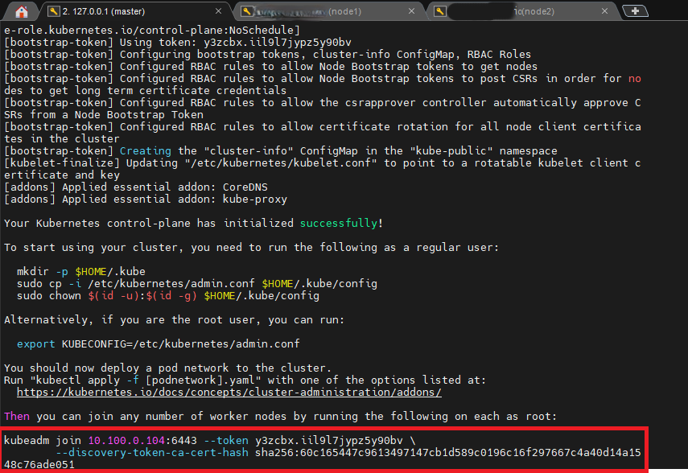
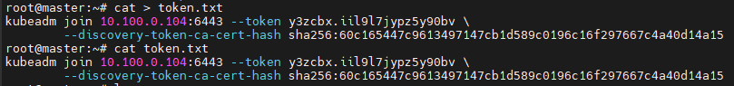

### control plane 구성 (마스터 노드만 실행)
```bash
$ mkdir -p $HOME/.kube
$ sudo cp -i /etc/kubernetes/admin.conf $HOME/.kube/config
$ sudo chown $(id -u):$(id -g) $HOME/.kube/config
$ systemctl restart kubelet
$ kubectl get nodes
```
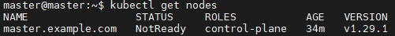

## CNI 설치
- 컨테이너 간의 통신을 지원하는 인터페이스(Pod Network)
- 서로 다른 ip주소로 되어 있는 컨테이너들을 연결시켜줌

### 위브넷(weavenet) 설치
```bash
$ kubectl apply -f https://github.com/weaveworks/weave/releases/download/v2.8.1/weave-daemonset-k8s.yaml
$ kubectl get nodes
# 적용하고서 아래 이미지처럼 STATUS가 Ready로 변경되어야 하는데, 네트워크 상태에 따라 10분 이상이 걸릴 수도 있다...
```
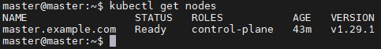

## 쿠버네티스 클러스터 구축 - 워커 노드

### 일반 node 구성 (워커 노드만 실행)
```bash
# 토큰이 유효한지 확인
$ sudo kubeadm token list

# TTL이 invalid라면 토큰을 새로 발급받고, valid하면 기존 토큰을 사용한다.
# 토큰 새로 발급받는 방법
$ kubeadm token create --print-join-command

# token.txt에 다시 저장
$ cat > token.txt # 토큰 복사 후 붙여넣고 ctrl + d

$ cd 
$ cat token.txt
# control plane 생서하면서 저장한 token 복사
```
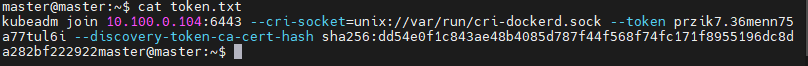

```bash
# 복사한 토큰 연결 명령어를 워커 노드에서 실행
$ sudo kubeadm join 10.100.0.104:6443 --cri-socket=unix://var/run/cri-dockerd.sock --token 개인토큰 --discovery-token-ca-cert-hash sha256: 해시코드

# 워커 노드에서 kubectl 명령어를 사용하기 위해 마스터 노드에 있는 admin.conf 복사
# *** 마스터 노드에서 실행 (conf 파일 복사 가능하도록 권한 허용)
$ cd /etc/kubernetes
$ sudo chmod 777 /etc/kubernetes/admin.conf

# *** 워커 노드에서 실행 (마스터 노드에 있는 conf 파일 복사)
$ mkdir -p $HOME/.kube
$ scp master@10.100.0.104:/etc/kubernetes/admin.conf $HOME/.kube/config

# 연결 확인
$ kubectl get nodes
```
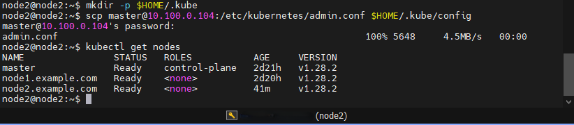

## 쿠버네티스 명령어 tab 키 자동 완성 설정
```bash
# bash-completion 설치 확인
$ type _init_completio

# 설치가 안 되어 있을 경우 설치 진행
$ apt-get install bash-completion
$ source /usr/share/bash-completion/bash_completion
$ type _init_completio

# (각 노드)시스템 전체 적용
$ kubectl completion bash | sudo tee /etc/bash_completion.d/kubectl > /dev/null
$ echo 'alias k=kubectl' >>~/.bashrc
$ echo 'complete -o default -F __start_kubectl k' >>~/.bashrc
$ exec bash
```

## 디스크 용량 변경
### VM 이미지 스냅샷을 찍었는데 디스크 용량 변경이 필요하다면,
### 가상머신을 복제하고 우분투에서 파티션 재생성 필요
- 디스크 용량 변경
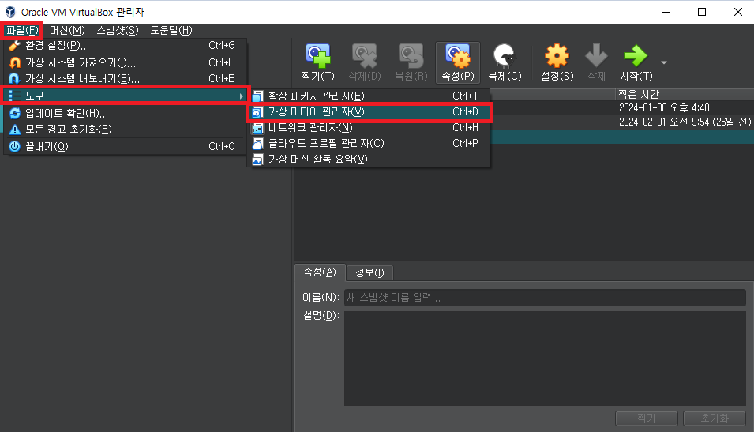
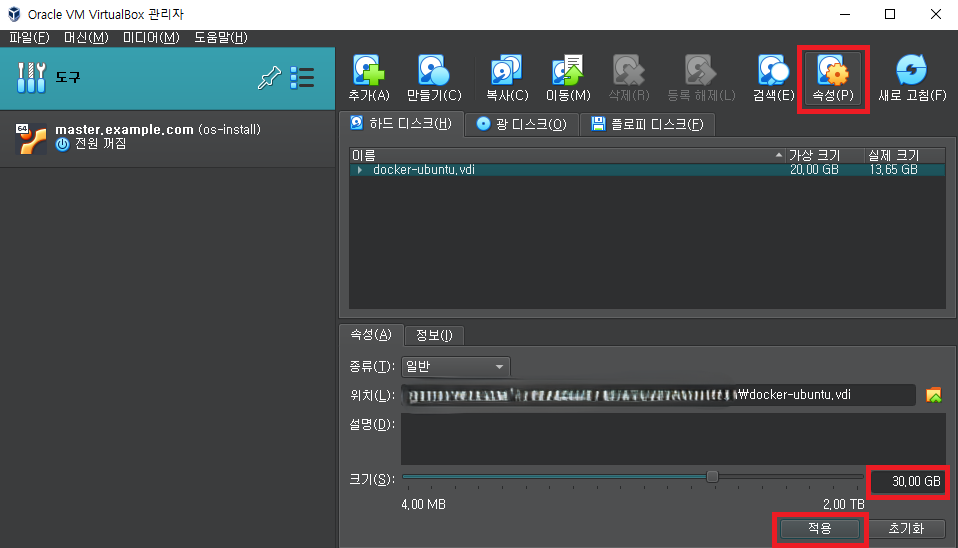

- 가상머신 복제
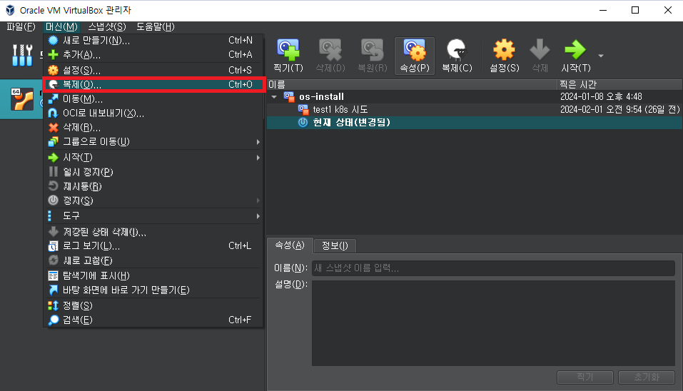
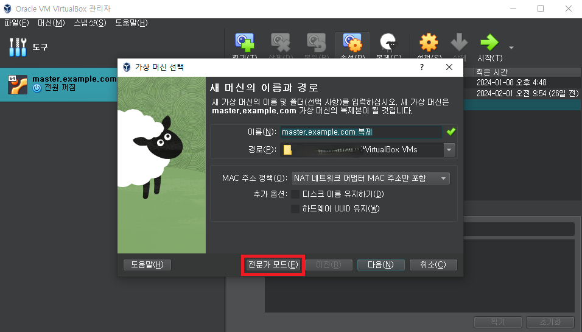
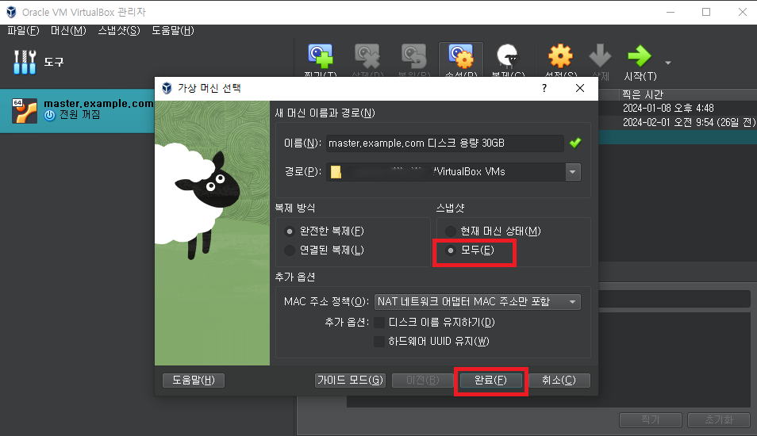

- 우분투에서 파티션 재생성
    ```bash
    # 파티션 디스크 용량 확인
    $ df -h
    ```
    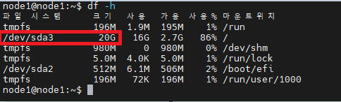
    ```bash
    # 변경한 디스크 용량이 적용이 안 되었다면 디스크 전체 용량 확인
    $ sudo fdisk -l
    ```
    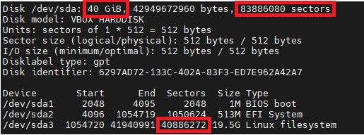
    
    ```bash
    # 디스크 전체 용량은 변경되었는데, 파티션 디스크 용량은 그대로라면 파티션 재생성
    $ sudo fdisk /dev/sda
    $ d           # 1. 커맨드 라인이 뜨면 d 입력 (기존 파티션 삭제)
    $ 3           # 2. 삭제할 파티션 넘버 3 입력 (Linux filesystem으로 사용 중인 파티션 sda3 삭제
    $ n           # 3. 파티션 생성 
    $ 3           # 4. 다음 파티션 default 값인 3 입력
    $ 1054720     # 5. 2번 파티션이 점유하고 있는 섹터의 다음 default 섹터인 1054720 입력
    $ 83886046    # 6. 디스크의 끝이자 default 섹터인 83886046 입력
    $ y           # 7. Partition #3 contains a ext4 signature Do you want to remove the signature? (새로운 파일 시스템을 생성하고 해당 파티션에 새로운 데이터를 저장할 것인지 물어보는 것)
    $ w           # 8. 변경 사항 저장
    
    # 생성한 파티션 반영
    $ sudo resize2fs /dev/sda3
    # 파티션 디스크 용량 확인
    $ df -h
    ```
