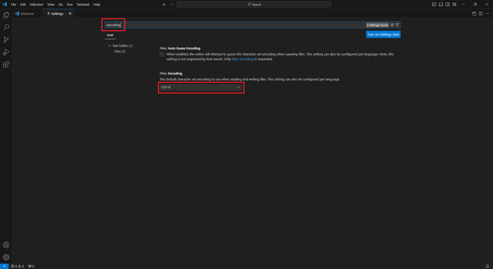
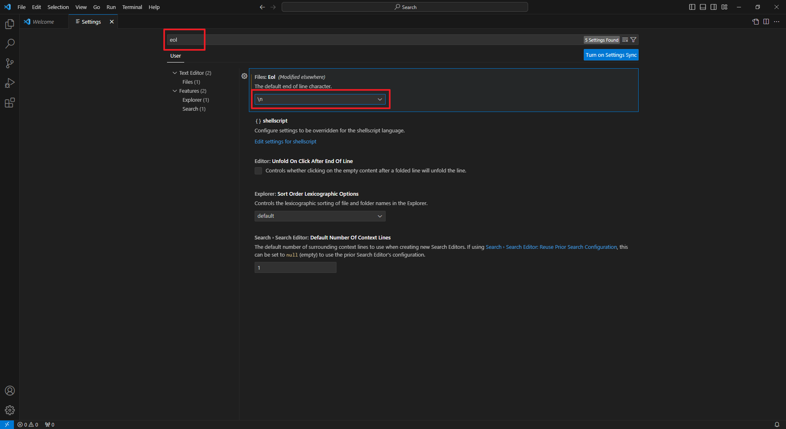

# VSCode 환경설정

## Encoding 설정

### File -> Preferences > Settings (단축키 : Ctrl + ',')
* encoding 입력
* UTF-8로 설정 되어 있는지 확인
  

## line separator 설정 (CRLF -> LF)
### File -> Preferences > Settings (단축키 : Ctrl + ',')
* eol 입력
* \n (LF) 선택
  