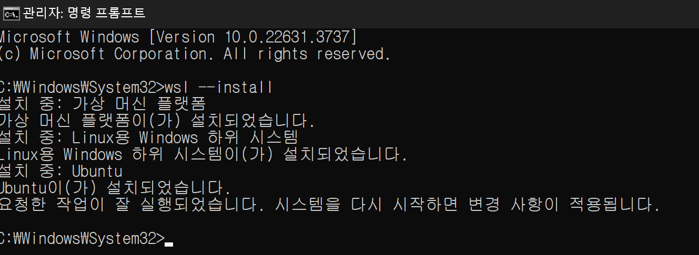

### WSL - Ubuntu 설치

- cmd 관리자 권한으로 실행

- 간혹 Ubuntu 설치 과정에서 진행도 올라가지 않으면 아래 방법 참고
    ```text
    1. Microsoft Store 접속(window에서 검색해서 들어가기)
    2. Ubuntu 검색 후 다운로드
    3. cmd 관리자 권한으로 실행
    4. wsl --install
    ```
- 컴퓨터 재부팅
- cmd 관리자 권한으로 실행
```bash
// Ubuntu 초기 설정을 위해 재설치
wsl --install
```